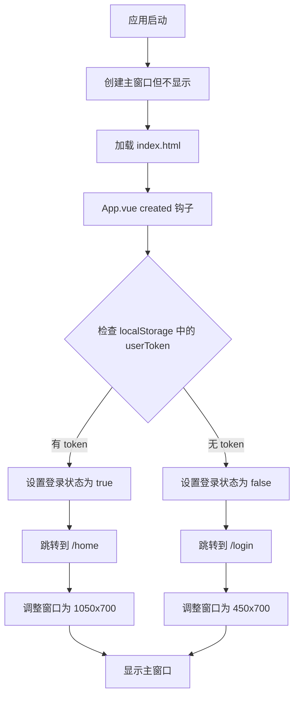

# 登录状态检测功能说明

## 📋 功能概述

应用现在会在启动时自动检测用户的登录状态，根据检测结果决定显示登录页面还是主页面。

---

## ✨ 实现逻辑

### 1. 启动流程



### 2. 核心文件修改

#### **主进程 (main.js)**

**变更点：**
- ✅ 启动时创建主窗口但 `show: false`（不立即显示）
- ✅ 添加 `check-login-status` IPC 处理器
- ✅ 添加 `show-main-window` IPC 处理器
- ✅ 移除强制清除 localStorage 的逻辑
- ✅ 优化日志系统（使用统一的 log 函数）

**代码示例：**
```javascript
// 创建主窗口时不显示
mainWindow = new BrowserWindow({
  width: 1050,
  height: 700,
  show: false, // 等待登录状态检查
  // ...其他配置
})

// IPC 处理器
ipcMain.on('show-main-window', () => {
  if (mainWindow) {
    mainWindow.show()
    mainWindow.focus()
  }
})
```

#### **App.vue**

**变更点：**
- ✅ 在 `created()` 钩子中添加登录状态检测
- ✅ 实现 `checkLoginAndNavigate()` 方法
- ✅ 根据登录状态跳转到不同路由
- ✅ 调整窗口尺寸（登录窗口 450x700，主窗口 1050x700）
- ✅ 显示窗口

**核心方法：**
```javascript
checkLoginAndNavigate() {
  const token = localStorage.getItem('userToken')
  
  if (token) {
    // 已登录：跳转到主页
    this.$store.commit('SET_TOKEN', token)
    this.$store.commit('SET_AUTHENTICATED', true)
    this.$router.replace('/home')
    this.showMainWindow()
  } else {
    // 未登录：跳转到登录页
    this.$store.commit('SET_AUTHENTICATED', false)
    this.$router.replace('/login')
    this.showLoginWindow()
  }
}
```

#### **路由配置 (router/index.js)**

**变更点：**
- ✅ 根路由 `/` 根据登录状态动态重定向
- ✅ 恢复所有需要登录的路由的 `requiresAuth: true`
- ✅ 优化路由守卫逻辑
- ✅ 已登录用户访问 `/login` 自动重定向到 `/home`

**路由守卫逻辑：**
```javascript
router.beforeEach((to, from, next) => {
  const isAuthenticated = localStorage.getItem('userToken') !== null
  
  // 需要登录且未登录 → 跳转到登录页
  if (to.matched.some(record => record.meta.requiresAuth) && !isAuthenticated) {
    next({ path: '/login', replace: true })
  }
  // 已登录访问登录页 → 跳转到主页
  else if (isAuthenticated && to.path === '/login') {
    next({ path: '/home', replace: true })
  }
  else {
    next()
  }
})
```

#### **预加载脚本 (preload.js)**

**变更点：**
- ✅ 添加 `showMainWindow` API

---

## 🎯 使用场景

### 场景 1：首次启动（无登录记录）

1. 用户双击启动应用
2. 应用检测到没有 `userToken`
3. 自动显示登录页面（450x700 窗口）
4. 用户可以进行登录或注册

### 场景 2：已登录状态启动

1. 用户之前已登录并保存了 token
2. 应用启动时检测到 `userToken` 存在
3. 自动跳转到主页（1050x700 窗口）
4. 直接显示主界面内容

### 场景 3：登录过期

1. 用户之前登录过，但 token 已过期
2. 可以在 store 中添加 token 验证逻辑
3. 验证失败后清除 token
4. 自动跳转到登录页

---

## 🔧 技术细节

### localStorage 存储

**Key:** `userToken`
**Value:** JWT token 或其他认证令牌
**位置:** 浏览器 localStorage

```javascript
// 设置 token
localStorage.setItem('userToken', token)

// 获取 token
const token = localStorage.getItem('userToken')

// 清除 token
localStorage.removeItem('userToken')
```

### 窗口尺寸控制

```javascript
// 登录窗口
window.electronAPI.resizeWindow(450, 700, true)

// 主窗口
window.electronAPI.resizeWindow(1050, 700, true)
```

### IPC 通信

**主进程 → 渲染进程：**
- `login-status-changed` - 登录状态改变通知

**渲染进程 → 主进程：**
- `check-login-status` - 检查登录状态
- `show-main-window` - 显示主窗口
- `login-success` - 登录成功通知
- `logout` - 退出登录

---

## 📝 测试步骤

### 测试 1：未登录状态启动

1. 清除浏览器 localStorage：
   ```javascript
   localStorage.clear()
   ```
2. 关闭并重新启动应用
3. **预期结果：** 显示登录页面，窗口尺寸 450x700

### 测试 2：已登录状态启动

1. 先登录一次，确保 localStorage 中有 token
2. 关闭应用
3. 重新启动应用
4. **预期结果：** 直接显示主页，窗口尺寸 1050x700

### 测试 3：登录后状态持久化

1. 在登录页面登录
2. 关闭应用（不要退出登录）
3. 重新启动应用
4. **预期结果：** 直接进入主页，无需重新登录

### 测试 4：退出登录

1. 在主页点击退出登录
2. **预期结果：** 跳转到登录页，窗口调整为 450x700
3. 重新启动应用
4. **预期结果：** 显示登录页（因为已退出）

---

## 🐛 调试技巧

### 查看日志

主进程日志会显示：
```
[时间戳] 应用就绪，检测登录状态
[时间戳] 创建主应用窗口...
[时间戳] 主窗口准备显示，等待登录状态检查
```

渲染进程日志会显示：
```
检查登录状态: 已登录/未登录
路由守卫: {to: '/home', from: '/', isAuthenticated: true}
```

### 手动设置登录状态

在浏览器控制台（F12）：
```javascript
// 模拟已登录
localStorage.setItem('userToken', 'test-token-123')
location.reload()

// 模拟未登录
localStorage.removeItem('userToken')
location.reload()
```

---

## ⚠️ 注意事项

1. **Token 验证：** 当前实现仅检查 token 是否存在，未验证有效性
2. **安全性：** 建议在实际项目中添加 token 过期检查
3. **用户体验：** 窗口显示有 100ms 延迟，确保内容加载完成
4. **路由守卫：** 所有需要登录的页面都设置了 `requiresAuth: true`

---

## 🔮 未来改进

- [ ] 添加 token 过期时间检查
- [ ] 实现自动刷新 token 机制
- [ ] 添加登录状态过渡动画
- [ ] 支持记住用户名功能
- [ ] 添加退出登录二次确认

---

## 📚 相关文件

- `main.js` - Electron 主进程
- `src/App.vue` - 应用根组件
- `src/router/index.js` - 路由配置
- `src/store/index.js` - Vuex 状态管理
- `preload.js` - 预加载脚本

---

**更新时间：** 2025-10-23  
**版本：** 1.1.0  
**作者：** 智能体应用开发团队
